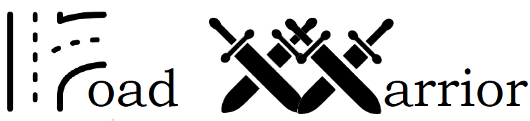
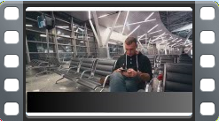

# Cloudeneers
> Participants in Architectural Katas, moderated by Neal Ford and Mark Richards, work together in small groups of their choosing to solve a challenge an actual organization is facing.

## Technical Presentation

Go to the [Video Script](./video/video_script.md)

#### References
- [Images from iStock](https://www.istockphoto.com/)
- [Videos from Storyblocks](https://www.storyblocks.com/)
- [Video edited via Canva](https://www.canva.com/)
- Music by [Aleksey Chistilin](https://pixabay.com/users/lexin_music-28841948/?utm_source=link-attribution&utm_medium=referral&utm_campaign=music&utm_content=116199) from [Pixabay](https://pixabay.com/music//?utm_source=link-attribution&utm_medium=referral&utm_campaign=music&utm_content=116199)

We respect the license agreements ([Licenses iStock](https://www.istockphoto.com/en/help/licenses), [Licenses Storyblocks](https://www.storyblocks.com/business-solutions/license-comparison)) 
of the above mentioned sites by providing the references to the sources used in the presented video.

## The Team
We are delighted to participate in Architectural Kata 2023. Prior to unveiling our solution, we would like to provide an introduction to our team:
[Cloudeneers](./team/introduction.md)

## Table of Content
1. [Introduction and Goals](./architecture/01_Introduction_And_Goals.md)
    1. [What is Road Warrior?](./architecture/01_Introduction_And_Goals.md#what-is-road-warrior)
    2. [Vision](./architecture/01_Introduction_And_Goals.md#vision)
    3. [Essential Features](./architecture/01_Introduction_And_Goals.md#essential-features)
    4. [Key Quality Characteristics](./architecture/01_Introduction_And_Goals.md#key-quality-characteristics)
    5. [Stakeholders](./architecture/01_Introduction_And_Goals.md#stakeholders)
2. [Constraints](./architecture/02_Constraints.md)
    1. [Assumptions](./architecture/02_Constraints.md#assumptions)
    2. [Technical Constraints](./architecture/02_Constraints.md#technical-constraints)
    3. [Organizational Constraints](./architecture/02_Constraints.md#organizational-constraints)
    4. [Conventions](./architecture/02_Constraints.md#conventions)
3. [Context](./architecture/03_Context.md)
    1. [Business Context](./architecture/03_Context.md#business-context)
    2. [Technical Context](./architecture/03_Context.md#technical-context)
4. [Solution Strategy](./architecture/04_Solution_Strategy.md)
5. [Architectural Quanta](./architecture/05_Architectural_Quanta.md)
6. [Architecture Decisions](./architecture/06_Architecture_Decisions.md)
7. [Architectural Characteristics](./architecture/07_Architectural_Characteristics.md)
    1. [Quality Requirements](./architecture/07_Architectural_Characteristics.md#quality-requirements)
    2. [Quality Scenarios](./architecture/07_Architectural_Characteristics.md#quality-scenarios)
8. [Risks](./architecture/08_Risks.md)
9. [Glossary](./architecture/09_Glossary.md)
