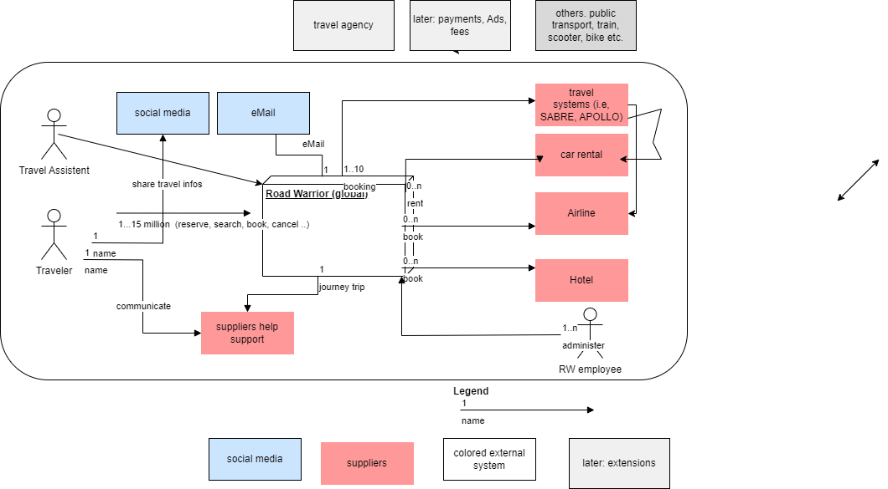
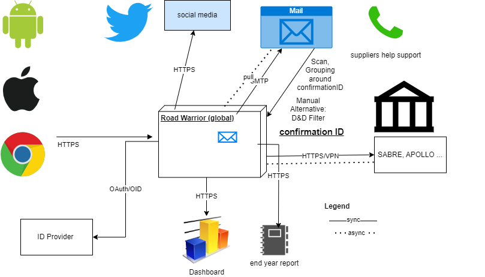
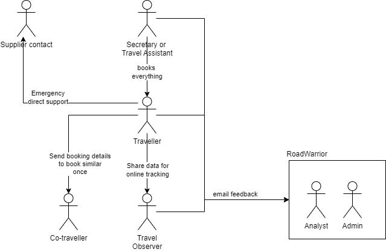
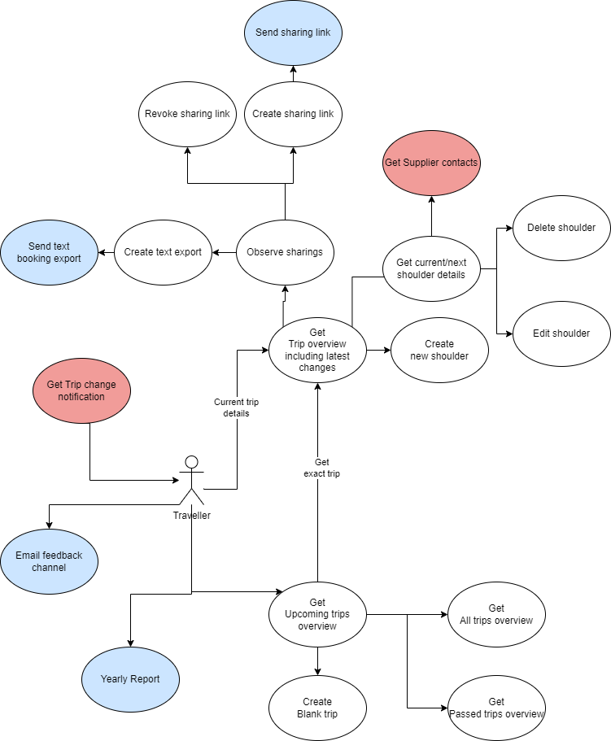
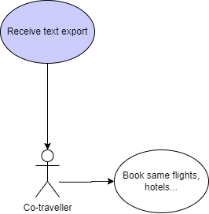
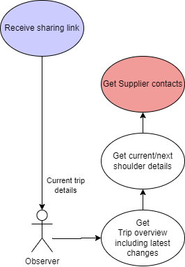
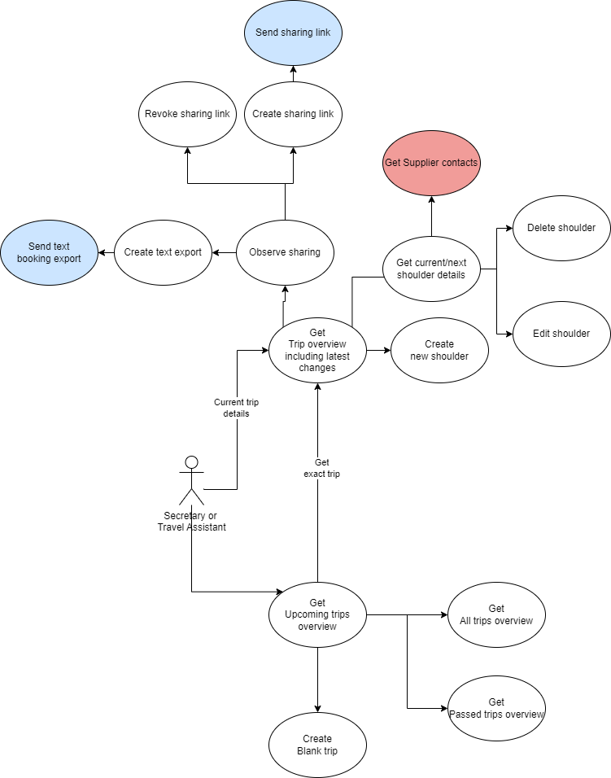

# Context
3. [Context](#context)
    1. [Business Context](#business-context)
    2. [Technical Context](#technical-context)
    3. [Use Cases](#use-cases)

> Defines the boundaries between the system and its communication counterparts (adjacent systems and users). It outlines the external interfaces, presenting both a business/domain viewpoint and a technical standpoint.

## Business Context
We concentrate here on the main actors and external systems. We differentiate communication and supplier external systems. Some grey systems are for future use, but not used for the first Road Warrior product.

| Role                                 | Description                                                                             |
|--------------------------------------|-----------------------------------------------------------------------------------------|
| Travel Assistant                     | Actor which acts as the preferred travel agency agent for quick problem resolution.      |
| Traveler                             | The actual Traveler interacting with the Road Warrior system.                            |
| Email Integration                    | The module responsible for polling and processing travel-related emails.                 |
| Sharing and Social Media Integration | The module responsible for enabling users to share trip information on social media platforms. |
| Travel Systems Integration           | The component that interfaces with external travel systems (e.g., SABRE, APOLLO, Hotel, car rental) for real-time updates. |
| Suppliers Help Support               | The help line for travelers to suppliers. They have read access to shared trips of travelers. |

## Technical Context
We only name the name protocols and formats, which must be refined later.

We support standard web protocols (https, SMTP, VPN) and formats (json).
For Authentication we will use ID Provider which support OAuth/OID protocol.

## Use Cases
### Actors Relations

| Role                            | Description                                                                                        |
|---------------------------------|----------------------------------------------------------------------------------------------------|
| Traveller                       | Person who travels and needs to get all the data.                                                  |
| Co-traveller                    | Person who wants to travel together and needs to book the same flight/hotel.                         |
| Travel Observer                 | Person who tracks the trip progress. For example, transfer service or a close friend.               |
| Secretary or Travel Assistant   | Some person who assists with booking and tracking changes. For most users, it will probably be a wife or husband. |
| RoadWarrior employees           | Receive feedback via FMB. Normally no direct communication required.                                |
| Supplier Contact                | Contact from Airlines, Taxi, Bus, or other trip suppliers for emergency situations.                |

### Traveller's

| Function                        | Description                                                                                                                         |
|---------------------------------|-------------------------------------------------------------------------------------------------------------------------------------|
| Get Upcoming Trips               | Basic view of trips that are not ended.                                                                                             |
| Create Blank Trip                | Create a new trip.                                                                                                                  |
| Get All Trips                    | Obtain a full list of trips.                                                                                                        |
| Get Passed Trips                 | Get a list of trips that have already ended. Useful for travel reporting.                                                            |
| Get Trip Overview                | Basic functionality to view certain trip details.                                                                                    |
| Create New Shoulder              | Manually add new information parts, such as a new taxi or train.                                                                    |
| Get Shoulder Details             | Get all the details for a particular part of the trip, including booking numbers and necessary identification data like QR or bar codes. |
| Edit Shoulder                    | Change booking details in the system based on updates received via alternative channels (e.g., phone) or unprocessed emails.         |
| Delete Shoulder                  | Remove current supplier information.                                                                                                 |
| Get Supplier Contacts            | Obtain first contact information for a supplier for emergency cases (e.g., taxi didn't appear, need to know where to call).          |
| Observe Sharings                 | Get a list of shared links.                                                                                                         |
| Create Sharing Link              | Create a new link to share with an Observer via a particular email.                                                                  |
| Send Sharing Link                | Send the link to the Observer.                                                                                                      |
| Revoke Link                      | Revoke a link if it was shared with the wrong recipient.                                                                            |
| Create Text Export               | Create an export in text format for Co-travellers with similar bookings.                                                            |
| Send Text Booking Export         | Send the created text export to Co-travellers.                                                                                       |
| Get Trip Change Notification     | Receive notifications about urgent trip updates.                                                                                     |
| Yearly Report                    | Receive a yearly report about travel information, routes, frequency, and more.                                                      |
| Email Feedback Channel           | Send feedback to developers via email.                                                                                               |

### Co-Traveller's

| Function                               | Description                                                           |
|----------------------------------------|-----------------------------------------------------------------------|
| Receive Text Export                    | Get a list of flights, hotel names, and all relevant booking data to book the same flights. |
| Book Same Flights, Hotels, etc.        | Book the same flights to sit together and book the same hotels, etc.  |

### Observer

| Function                                   | Description                                                            |
|--------------------------------------------|------------------------------------------------------------------------|
| Receive Sharing Link                       | Get the link to track a friend or client's trip.                        |
| Get Trip Overview Including Latest Changes | Obtain an overview of the trip, including the latest updates.          |
| Get Shoulder Details                        | Get precise details about a trip part (e.g., airplane) for a more comprehensive status update. |
| Get Supplier Contacts                       | Obtain emergency contact information if the status is not representative but data is required. |

### Secretary

| Function                        | Description                                                                                         |
|---------------------------------|-----------------------------------------------------------------------------------------------------|
| Get Upcoming Trips               | Basic view of trips that have not ended.                                                            |
| Create Blank Trip                | Create a new trip.                                                                                 |
| Get All Trips                    | Obtain a full list of all trips.                                                                   |
| Get Passed Trips                 | Get a list of trips that have already ended. Useful for travel reporting.                            |
| Get Trip Overview                | Basic functionality to view certain trip details.                                                   |
| Create New Shoulder              | Manually add new information parts, such as a new taxi or train.                                   |
| Get Shoulder Details             | Get all the details for a particular part of the trip, including booking numbers and necessary identification data like QR or bar codes. |
| Edit Shoulder                    | Change booking details in the system based on updates received via alternative channels (e.g., phone) or unprocessed emails.        |
| Delete Shoulder                  | Remove current supplier information.                                                                |
| Get Supplier Contacts            | Obtain emergency contact information for a supplier in case of emergencies (e.g., taxi did not appear - where to call).           |
| Observe Sharings                 | Get a list of shared links.                                                                         |
| Create Sharing Link              | Create a new link to share with an Observer using a particular email.                               |
| Send Sharing Link                | Send the link to the Observer.                                                                      |
| Revoke Link                      | Revoke a link if it was shared with the wrong recipient.                                           |
| Create Text Export               | Create an export in text format for Co-travellers with similar bookings.                             |
| Send Text Booking Export         | Send the created text export to Co-travellers.                                                      |

[<<Previous Page](./02_Constraints.md) ---- [Next Page >>](./04_Solution_Strategy.md)

