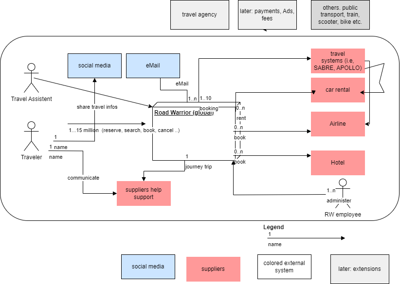

# Context
Defines the boundaries between the system and its communication counterparts (adjacent systems and users). It outlines the external interfaces, presenting both a business/domain viewpoint and a technical standpoint.

## Business Context
We concentrate here on the main actors ans exernal systems. We differntiate communcation and supplier externla systems. Some grey systems are for future use, but not used for the first RoadWorriar product.

## Technical Context
We only name the name protocols and formats, which must be refined later.

