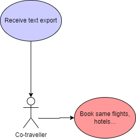

# Context
3. [Context](#context)
    1. [Business Context](#business-context)
    2. [Technical Context](#technical-context)

> Defines the boundaries between the system and its communication counterparts (adjacent systems and users). It outlines the external interfaces, presenting both a business/domain viewpoint and a technical standpoint.

## Business Context
We concentrate here on the main actors and external systems. We differentiate communication and supplier external systems. Some grey systems are for future use, but not used for the first Road Warrior product.

### Travel Assistant
Actor which acts as the preferred travel agency agent for quick problem resolution.
### Traveler
The actual Traveler interacting with the Road Warrior system.
### Email Integration
The module responsible for polling and processing travel-related emails.
### Sharing and Social Media Integration
The module responsible for enabling users to share trip information on social media platforms.
### Travel Systems Integration
The component that interfaces with external travel systems (e.g., SABRE, APOLLO, Hotel, car rental) for real-time updates.
### Suppliers help support
The help line for travelers to suppliers. They have read access to shared trips of travellers.

## Technical Context
We only name the name protocols and formats, which must be refined later.

We support standard web protocols (https, SMTP, VPN) and formats (json).
For Authentication we will use ID Provider which support OAuth/OID protocol.

## Use Cases
### Actors Relations

### Traveller's

### Co-Traveller's

### Observer

### Secretary

[<<Previous Page](./02_Constraints.md) ---- [Next Page >>](./04_Solution_Strategy.md)

