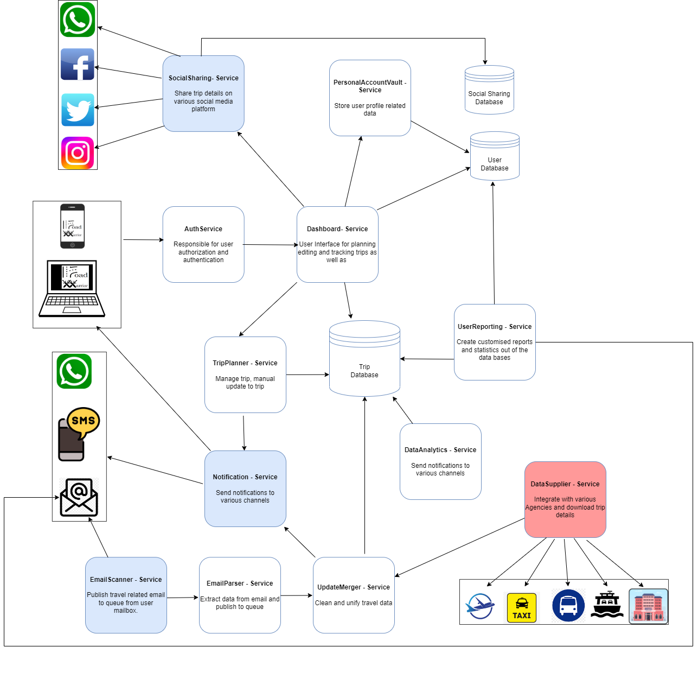

# Architectural Quanta
5. [Architectural Quanta](#architectural-quanta)
   1. [Components And Responsibilities](#components-and-responsibilities)
      1. [Presentation Layer](#presentation-layer)
      2. [API Gateway](#api-gateway)
      3. [Services](#services)
         1. [EmailScanner](#emailscanner)
         2. [EmailParser](#emailparser)
         3. [UpdateMerger](#updatemerger)
         4. [DataSupplier](#datasupplier)
         5. [TripPlanner](#tripplanner)
         6. [TripDashboard](#tripdashboard)
         7. [Notification](#notification)
         8. [SocialSharing](#socialsharing)
         9. [PersonalAccountVault](#personalaccountvault)
         10. [UserReporting](#userreporting)
         11. [DataAnalytics](#dataanalytics)

> "An independently deployable artifact with high functional cohesion and synchronous connascence" (Fundamentals of Software Architecture by Mark Richards an Neal Ford)

Based on the requirements and the design decisions we took for the  next-generation online trip management dashboard, 
we identified the following architectural quanta. The below illustration shows an overview of
the core components:

## Components and Responsibilities
### Presentation layer
  
  Progressive Web App (PWA) (refer to: [0004-PWA](../ADRs/0004-PWA.md)) allow application to be developed that can be accesses via web browsers but behave like native app.
  Following are some key features of PWA:
   - Cross-platform compatible
   - Provide excellent offline support
   - Support faster development
   - Deployment process is seamless and does not depend on app stores

### API Gateway

   API gateway (refer to: [0008-API-Gateway](../ADRs/0008-API-Gateway.md)) to act as a single entry point for collection of microservices.
   Central entity to manage, route and secure API requests and responses.
   Following are some key features of API Gateway:
   - Request routing
   -  Load balancing
   - Authentication and authorization
   -  Rate limiting and throttling
   - Security
   - Logging and monitoring
   - Caching

### Services
Below, you will discover the system's contemplated services. Please note that crucial components, which are mandatory to provide a first MVP (Minimum Viable Product),  are elaborated on in greater detail, offering a transparent view of their inner workings

#### EmailScanner
- Scans user mailboxes for emails.
- Filters emails based on predefined rules.
- Publishes relevant emails to a message queue.

[Go to whitebox view](../quanta/1-emaildata-collector-quanta.md)

#### EmailParser
- Reads emails from the message queue and parses them to collect relevant data.
- Cleans and unifies data, then pushes it to a message queue to be consumed by the UpdateMerger service.

[Go to whitebox view](../quanta/1-emaildata-collector-quanta.md)

#### UpdateMerger
- Identifies duplicate trips.
- Merges data from duplicate trips and pushes integrated data to the database.

[Go to whitebox view](../quanta/1-emaildata-collector-quanta.md)

#### DataSupplier
- This service communicates with various Agency APIs.
- Received data is parsed and stored in storage.

[Go to whitebox view](../quanta/2-data-supplier-quanta.md)

#### TripPlanner
- Manages various user trips.
- Prioritizes trips based on various parameters.
- Allows updates to user trips.

[Go to whitebox view](../quanta/3-trip-planner-quanta.md)

#### TripDashboard
- Constructs a dataset to be served to the Dashboard.
- Provides an optimized dataset that is relevant for the caller.

[Go to whitebox view](../quanta/4-trip-dashboard-quanta.md)

#### Notification
- Central hub to perform all notification tasks via various services, like push notifications, email, WhatsApp, SMS, etc.

[Go to whitebox view](../quanta/5-notification-hub-quanta.md)

#### SocialSharing
- Provides a common interface to post/share user trip data on various social media platforms, like X (formerly Twitter), Facebook, Instagram, etc.

[Go to whitebox view](../quanta/6-social-sharing-quanta.md)

#### PersonalAccountVault
- Vault to manage user accounts.

#### UserReporting
- Reporting service to build data structures for user reporting.

#### DataAnalytics
- Performs data analytics on data.
- With the help of machine learning, devises travel trends, preferred locations, communication modes, etc.

[<<Previous Page](./04_Solution_Strategy.md) ---- [Next Page >>](./06_Architecture_Decisions.md)
