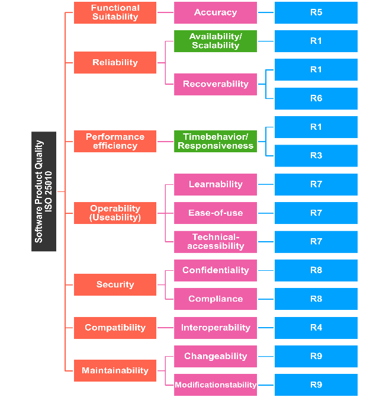

# Architectural Characteristics
> "Identifying the driving architectural characteristics is one of the first steps in creating an architecture or determining the validity of an existing architecture." (Fundamentals of Software Architecture by Mark Richards an Neal Ford)

This section presents a comprehensive compilation of quality requirements in the form of a quality tree, complete with associated scenarios. The most critical quality requirements have already been detailed in Section 1 ([Key Quality Characteristics](01_Introduction_And_Goals.md#key-quality-characteristics)).
## Quality Requirements
The diagram below provides a comprehensive overview of the relevant quality characteristics and the corresponding situations they encompass. Additionally, the quality objectives are integrated into the illustration, with each one being linked to the [Quality Scenarios](07_Architectural_Characteristics.md#quality-scenarios) that exemplify them.

The quality goals highlighted in green are the three [Key Quality Characteristics](01_Introduction_And_Goals.md#key-quality-characteristics) mentioned previously in this documentation.

## Quality Scenarios
In the table below, you'll discover a collection of recognized quality scenarios, each identified by a unique ID representing a specific quality requirement. These ID labels are also employed within the [Quality Requirements](07_Architectural_Characteristics.md#quality-requirements). It's important to note that some scenarios may not neatly align with a single characteristic, resulting in their multiple appearances within the quality tree.

| ID  | Quality Goal           |                                                                                                                                                                                                                                                                                                                                                                                               Motivation                                                                                                                                                                                                                                                                                                                                                                                                |
|-----|------------------------|:-------------------------------------------------------------------------------------------------------------------------------------------------------------------------------------------------------------------------------------------------------------------------------------------------------------------------------------------------------------------------------------------------------------------------------------------------------------------------------------------------------------------------------------------------------------------------------------------------------------------------------------------------------------------------------------------------------------------------------------------------------------------------------------------------------:|
| R1  | High Availability |                                                                                                                                                                                                                                                          Based on the technical requirement discussed with the stakeholder the users must be able to access the system at all times (max 5 minutes per month of unplanned downtime). Along with that Travel updates must be presented in the app within 5 minutes of generation by the source.                                                                                                                                                                                                                                                          |
| R2  |  Scalability       |                                                                                                                                                                                                                                                                                                                                                Ensuring that the system can handle the two million active users per week and support international usage                                                                                                                                                                                                                                                                                                                                                |
| R3  |  Responsiveness    |                                                                                                                                                                                                                                                                                                                                                           Response time from web (800ms) and mobile (First-contentful paint of under 1.4 sec)                                                                                                                                                                                                                                                                                                                                                           |
| R4  | Interoperability       | Seamless Integration with Existing Travel Systems and Rapid Issue Resolution: The system is required to establish seamless connections with the airline, hotel, and car rental interface systems currently utilized by the agency. This integration serves to maintain up-to-date travel information, encompassing real-time updates on delays, cancellations, gate changes, and other pertinent details. Furthermore, the system should be capable of interfacing with the agency's preferred travel agency to expedite issue resolution and provide timely assistance. This collaborative approach ensures that the travel system harmoniously coexists with the agency's existing infrastructure, including systems like SABRE and APOLLO, for streamlined operations and enhanced traveler support. |
| R5  | Functional Suitability |               Ensuring the Precision of Travel-Related Email Identification: The email polling system must maintain high accuracy in identifying travel-related emails based on specified input parameters. This accuracy is assessed through four key metrics: 1) True Positives: The system correctly identifies emails that are genuinely travel-related. 2) False Positives: Non-travel-related emails that are incorrectly identified as travel-related. 3) True Negatives: Non-travel-related emails that are accurately identified as non-travel-related. 4) False Negatives: Travel-related emails that are mistakenly classified as non-travel-related. The goal is to optimize these metrics to enhance the precision of travel-related email identification within the system.               |
| R6  | Recoverability         |                                                                                                                                                                                                                                                                                                                          Users should have uninterrupted access to the system, with a maximum allowable downtime of no more than 5 minutes per month due to unplanned events.                                                                                                                                                                                                                                                                                                                           |
| R7  | Useability             |                                                                                                                                                                                                                                                                                                             Create the most robust user interface across all deployment platforms, ensuring a seamless and feature-rich user experience regardless of the device or operating system used.                                                                                                                                                                                                                                                                                                              |
| R8  | Security (Compliance)  |                                                                                                                                                                                                                                                                  Road Warrior collects analytical data from user trips to support a variety of objectives, including identifying travel trends, tracking preferred locations, assessing airline and hotel vendor preferences, monitoring cancellation and update frequency, and more.                                                                                                                                                                                                                                                                   |
| R9  | Maintainability        |                                                                                                                                                                                                                                                                                             Deliver annual summary reports to users containing a diverse array of travel usage metrics, with the flexibility to modify and expand the metrics in the future as needed to ensure data quality and relevance.                                                                                                                                                                                                                                                                                             |
