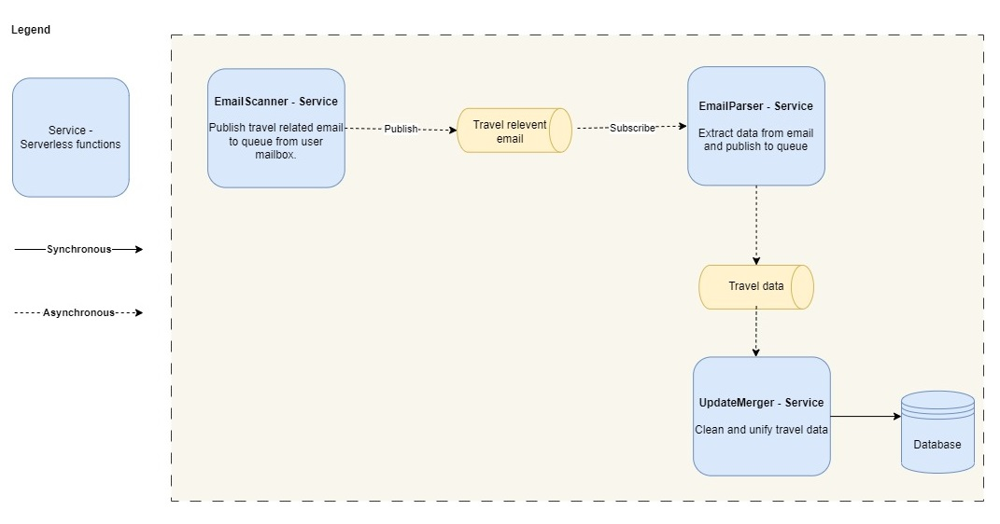

# Email Data Collector Quanta

| Service      |                                                                                                                 Description                                                                                                                  | 
|--------------|:--------------------------------------------------------------------------------------------------------------------------------------------------------------------------------------------------------------------------------------------:|
| EmailScanner |          Responsible for polling user emails to identify travel-related emails. Filters and whitelists certain emails to ensure relevant travel information is captured. Publishes travel related emails to the EmailParserService.          |
| EmailParser  | Parses the travel-related emails retrieved by the EmailScannerService to extract relevant information like flight details, hotel reservations, car rentals, etc. Transforms the parsed data into a structured format for further processing. |
| UpdateMerger |                                                     Aggregates and merges travel information received by the EmailParser. Stores consolidated and accurate information to the database.                                                      |
| Database     |                                                                                             Holds the aggregated and merged travel information.                                                                                              |

[<<Back to 05_Architectural_Quanta](../architecture/05_Architectural_Quanta.md) 
