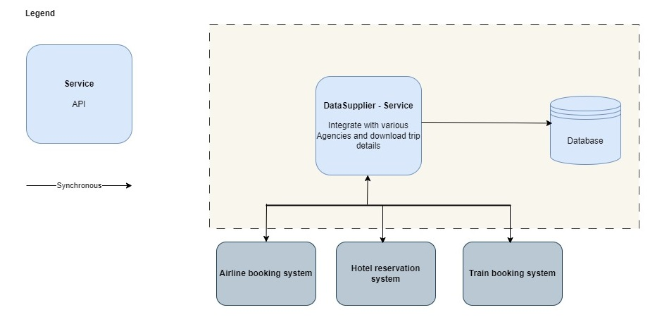

# Data Supplier Quanta

| Service             |                                                                                                                                            Description                                                                                                                                            | 
|---------------------|:-------------------------------------------------------------------------------------------------------------------------------------------------------------------------------------------------------------------------------------------------------------------------------------------------:|
| DataSupplierService | Interfaces with existing airline, hotel, and train booking systems (e.g., SABRE, APOLLO) to fetch real-time travel updates, such as delays, cancellations, gate changes, and more. Ensures that travel updates are delivered to the dashboard within 5 minutes of their generation by the source. |
| Database            |                                                                                                                                Holds all relevant travel updates.                                                                                                                                 |
| External Systems    |                                                                                                                      The external airline, hotel and train booking systems.                                                                                                                       |

[<<Back to 05_Architectural_Quanta](../architecture/05_Architectural_Quanta.md) 
