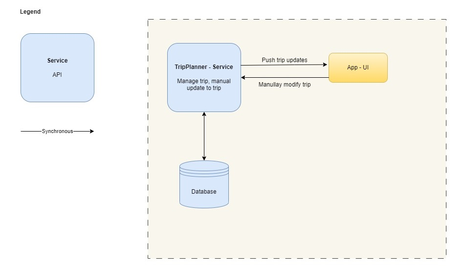

# Trip Planner Quanta

| Service            |                                                                                                    Description                                                                                                     | 
|--------------------|:------------------------------------------------------------------------------------------------------------------------------------------------------------------------------------------------------------------:|
| TripPlannerService | Allows users to add, update, or delete existing reservations manually. Organizes travel reservations into trips based on user preferences. Automatically removes items from the dashboard once a trip is complete. |
| App-UI             |                                                                                    [Trip Dashboard](4-trip-dashboard-quanta.md)                                                                                    |
| Database           |                          Holds all relevant travel information of the user.                                                                                                                                                                                           |

[<<Back to 05_Architectural_Quanta](../architecture/05_Architectural_Quanta.md) 
