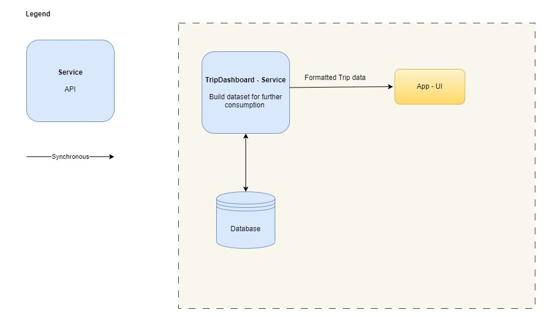

# Trip Dashboard Quanta

## Whitelist View

| Service              |                                                       Description                                                        | 
|----------------------|:------------------------------------------------------------------------------------------------------------------------:|
| TripDashboardService |           The backbone for the TripDashboard UI. Provides an optimized dataset that is relevant for the caller           |
| App-UI               | Provides a rich user interface accessible via web and mobile devices and displays travel information organized by trips. |
| Database             |                                    Holds all relevant travel information of the user.                                    |

## Trip Dashboard Mockup
Below you will find some first UI drafts of the online Trip Dashboard.

## Landing page
This view illustrates a consolidated view of the current and upcoming trips:

## Trip Element
This view illustrates a detailed view of a trip element. For example some details of a hotel reservation:

[<<Back to 05_Architectural_Quanta](../architecture/05_Architectural_Quanta.md) 
