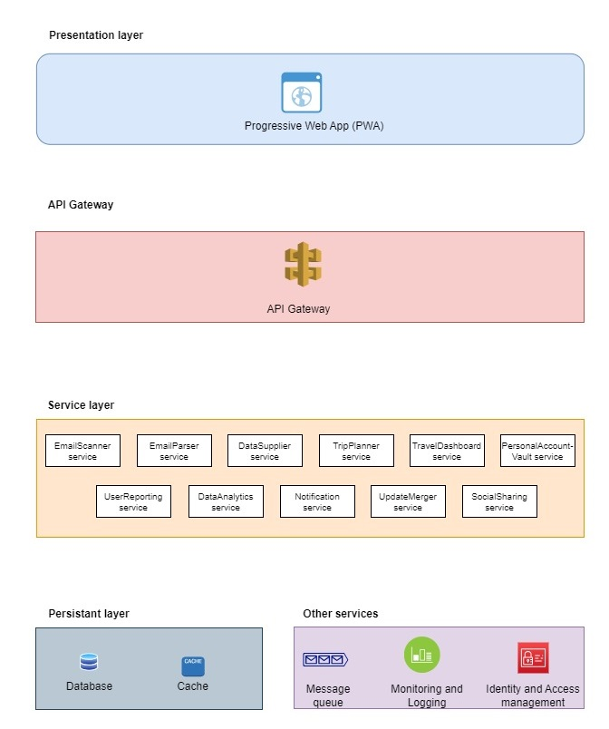

## RoadWarrior Quantum

### Components and Responsibilities
* **Presentation layer**
  * Progressive Web App (PWA)
	* 
	* PWA is a web application that can be accessed through a web browser but behaves like a native app with offline support and home screen icons. 
	* PWAs are designed to work on any platform and device, and don't need to be downloaded from app stores.
	* PWAs provide a better user experience as they can be designed to work effectively in offline mode or with limited connectivity.
	* PWAs can run on any device with a modern browser thus providing a consistent experience across platforms.
	* PWAs are designed to be fast and responsive, improving the overall user experience.
	* PWAs can offer features like push notifications, which can help to keep users engaged with your app.
	* PWAs can be developed and deployed quickly and at a lower cost compared to native apps.

*  **API Gateway**
	
* **Services**
  * EmailScanner
	* Scans user mail box for emails.
	* Filter email based on pre-defined rules.
	* Publish relevent emails to a message queue.
  * EmailParser
	* Read email from the message queue and parses to collect relevent data.
	* Data is the pushed to persistent layer for storage.
  * AgencyManager
	* This service communicates with various Agency API's.
	* Received data is parsed and stored in storage.
  * TripManager
	* Manage various user trips.
	* Prioratization of trips based various parameters.
	* Allow updates to user trips.
  * TravelDashboard
   * Construct data structures to be served to the Dashboard. 
  * PersonalAccountVault
	* Manage user account details.
  * UserReporting
	* Reporting service to build data structures for user reporting.
  * DataExporter
	* This service is responsible to construct data required by external entities, like Airlines, hotels, etc.
	* Integrate with respective webservices to send processed data from RoadWarrior to interested parties.
  * DataAnalytics
	* Perform data analytics on data.
	* With help of machine learning devise travel trends, preferred locations, communtation modes, etc.
  * Notification
	* Central hub to perform all notification tasks via various services, like push notification, email, WhatsApp, SMS. etc.
  * UpdateMerger
	* Identify duplicate trips
	* Merge data from duplicate trips and ensure data integrity
  * SocialMedia
	* Single getway to post/ share user trip data to various social media platforms, like X (formerly Twitter), Facebook, Instagram, etc.
	* Pre-authorize access to user social media account for efficient usage.
