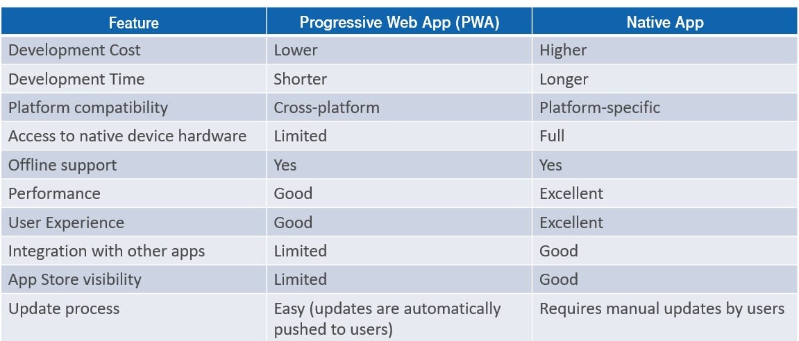

## RoadWarrior Quantum

### Components and Responsibilities
* **Presentation layer**
	Progressive Web App (PWA) allow application to be developed that can be accesses via web browsers but behave like native app.
	Following are some key features of PWA:
	* Cross-platform compatible
	* Provide excellent offline support
	* Support faster development
	* Deployment process is seamless and does not depend on app stores
	
	
	
	
*  **API Gateway**
	API gateway to act as a single entry point for collection of microservices.
	Central entity to manage, route and secure API requests and responses.
	Following are some key features of API Gateway:
	* Request routing
	* Load balancing
	* Authentication and authorization
	* Rate limiting and throttling
	* Security
	* Logging and monitoring
	* Caching
	
* **Services**
  * EmailScanner
	* Scans user mail box for emails.
	* Filter email based on pre-defined rules.
	* Publish relevent emails to a message queue.
  * EmailParser
	* Read email from the message queue and parses to collect relevent data.
	* Cleaned, unified data is then pushed to message queue to be consumed by UpdateMerger service.
  * DataSupplier
	* This service communicates with various Agency API's.
	* Received data is parsed and stored in storage.
  * TripPlanner
	* Manage various user trips.
	* Prioratization of trips based various parameters.
	* Allow updates to user trips.
  * TravelDashboard
	* Construct dataset to be served to the Dashboard.
	* Provide optimized dataset that is relevent for the caller.
  * PersonalAccountVault
	* Vault to manage user accounts.
  * UserReporting
	* Reporting service to build data structures for user reporting.
  * DataAnalytics
	* Perform data analytics on data.
	* With help of machine learning devise travel trends, preferred locations, communtation modes, etc.
  * Notification
	* Central hub to perform all notification tasks via various services, like push notification, email, WhatsApp, SMS. etc.
  * UpdateMerger
	* Identify duplicate trips.
	* Merge data from duplicate trips and ensure data integrity.
  * SocialSharing
	* Common interface to post/ share user trip data to various social media platforms, like X (formerly Twitter), Facebook, Instagram, etc.