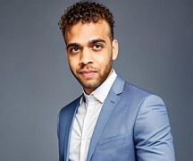
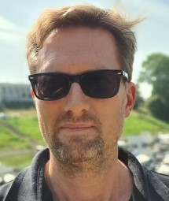
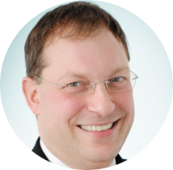
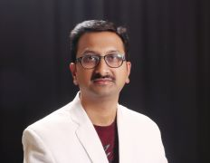

# The Cloudeneers
We are delighted to participate in Architectural Kata 2023. Prior to unveiling our solution, we would like to provide an introduction to our team:

> 
>> Tobi Oredein - Enterprise Architect, Automotive
>>> "Focus on Quality Attributes, not on functional requirements. Quality Attribute Requirements (QARs) drive the architecture." (Murat Erder, Pierre Pureur, in Continuous Architecture, 2016)

> 
>> Andreas Hegenscheidt - Lead Architect, TC Services (WAN, LAN, VoIP, Security, Cloud Connection, WLAN, Unified Collaboration Tools...)
>>> Responsable for technical architecture over all services in complex and large DTAG customer projects (Focus Accounts) since 2009.
>>> Member of DTAG since 1987

> 
>> Frank Pientka - Senior Multi-Cloud Architect, Cloud Advisory
>>> "Bring more Quality into Software"

> 
>> Sandeep Gaikwad - Senior Solution Architect, Digital Application Hub 
>>> Responsible for designing, developing and modernizing large enterprise applications in various technologies like Java, .NET, Python, Frontend, Cloud...

> 
>> Ilia Kutuzov - Solution Architect, CI/CD Hub
>>> Driving DevOps toolset rollout and delivering stable automation directly to the projects.
